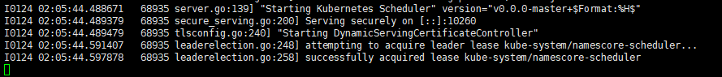
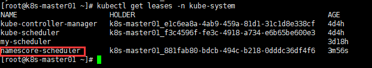
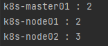
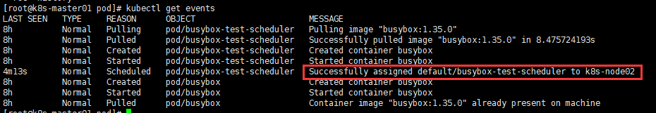

# kube-scheduler自定义插件

> 这个仓库是干啥的？
>
> 最近在折腾怎么自定义scheduler，主要有三种方式：
>
> * 修改配置文件：只能基于现有插件做到调度策略上的微调
> * 实现自己的插件：可以实现自己的插件，实现个性化的调度（比如基于GPU调度）
> * 基于scheduler源码二次开发：基于源码重写、编译，彻底的自定义
>
> 这里属于第二种，折腾了老半天才弄好，所以记录一下，这里只是实现了一个插件的demo，只需要在`/pkg`目录下实现自己的插件即可，`main.go`负责插件的注册，编译后就能得到附带你插件的scheduler了，打包镜像使用即可。

## 0.如何使用

> 环境说明：
> k8s版本：1.23.1
> kubescheluer.config版本：v1beta3
> 版本比较关键！

直接make build即可得到kube-scheduler的二进制程序

~~~bash
make build
./bin/run.sh
~~~

命令参考：[kube-scheduler | Kubernetes](https://kubernetes.io/zh/docs/reference/command-line-tools-reference/kube-scheduler/)

配置文件api参考：[kube-scheduler Configuration (v1beta3) | Kubernetes](https://kubernetes.io/docs/reference/config-api/kube-scheduler-config.v1beta3/)

注意如果集群开启了RBAC，还需要将 将调度器名称添加到应用了 `endpoints` 和 `leases` 资源的规则的 resourceNames 中：

~~~
kubectl edit clusterrole system:kube-scheduler
~~~

添加你的调度器名字：

~~~yaml
...
- apiGroups:
      - coordination.k8s.io
    resourceNames:
      - kube-scheduler
      - my-scheduler
    resources:
      - leases
    verbs:
      - get
      - update
  - apiGroups:
      - ""
    resourceNames:
      - kube-scheduler
      - my-scheduler
    resources:
      - endpoints
    verbs:
...
~~~

## 1.关于插件的开发

就在`pkg`目录下开发，只需要实现相应扩展点的接口即可，然后在配置文件中启动该插件即可

如果你需要开发你K8s版本的插件，需要修改go.mod，如果直接删掉，想用`go mod tidy`获得最新版本的话，会出现问题（kubernetes在设计上会独立发布各个模块，并对外屏蔽部分不稳定的代码，避免主仓库作为一个整体被外部引用，所以将部分模块的依赖版本写成了v0.0.0，然后再用replace替换成了代码仓库里的相对路径，即staging目录里的独立模块）：

~~~
k8s.io/api@v0.0.0: reading k8s.io/api/go.mod at revision v0.0.0: unknown revision
~~~

还好是搜到了解决方案，使用`hack/get-k8s-as-dep.sh`生成指定版本的go.mod就好了

## 2.简单的展示一下这个插件

这个插件实现了score扩展点，通过节点的名字来打分，具体打分逻辑很简单（自行看代码）

运行run.sh后（为了调试方便，这里没有打包镜像，直接运行）：

可以看到调度器正在运行：

然后我们创建pod，指定调度器：

~~~yaml
apiVersion: v1
kind: Pod
metadata:
  name: busybox-test-scheduler
  namespace: default
spec:
  schedulerName: namescore-scheduler
  containers:
  - name: busybox
    image: busybox:1.35.0
    command:
      - sleep
      - "3600"
    imagePullPolicy: IfNotPresent
  restartPolicy: Always
~~~

通过预先计算可以知道，三个节点的打分如下，所以理应会调度到k8s-node02节点上

然后创建上述pod，果然被调度到了k8s-node02节点上，符合预期！

